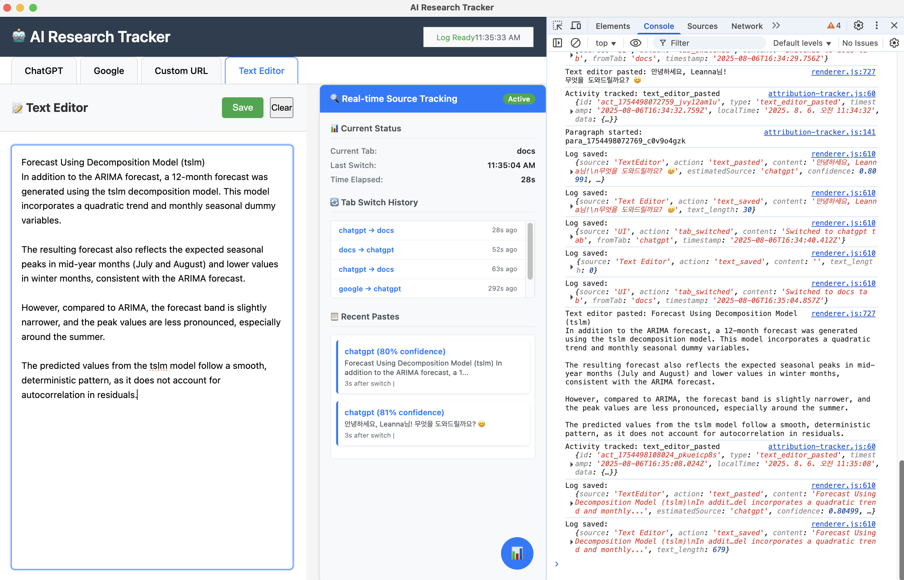

# 🤖 AI Research Tracker

A desktop application built with ElectronJS that tracks the research and writing process from start to finish.

## 🚀 Features

### MVP Features
- **Multi-tab WebView Interface**
  - ChatGPT (https://chat.openai.com)
  - Google Search (https://www.google.com)
  - Custom URL input
  - Text Editor (local autosave)

- **Activity Logging**
  - ChatGPT: prompt/copy detection (simple copy detection within WebView)
  - Google: search query tracking (URL-based)
  - Websites: URL visit and page load tracking
  - Tab switching activities
  - Text Editor: save/paste/copy events and source estimation

- **Local Storage**
  - JSON file-based log storage (`logs/actions.json`)
  - Text editor content is autosaved to `localStorage`

## 📦 Installation & Setup

### 1. Requirements
- Node.js 18+
- macOS (for development environment)

### 2. Install Dependencies
```bash
npm install
```

### 3. Run the Application
```bash
# Normal execution
npm start

# Development mode (with DevTools)
npm run dev
```

## 📁 Project Structure

```
ai_tracking_system/
├── main.js              # Electron main process (window + logging IPC)
├── preload.js           # Security bridge (exposes IPC API)
├── index.html           # Main UI (tabs/editor/debug panel)
├── renderer.js          # Renderer (tabs/logging/editor/source estimation)
├── attribution/
│   └── attribution-tracker.js  # Attribution logic (collects web/editor activity)
├── logs/
│   └── actions.json     # Activity log (auto-generated)
├── package.json         # Project configuration
└── README.md            # Project documentation
```

## 📊 Log Format

Each activity is stored in the following format:

```json
{
  "timestamp": "2025-01-17T10:12:33.456Z",
  "source": "ChatGPT",
  "action": "prompt_submitted",
  "content": "difference between RL and RLHF..."
}
```

### Supported Action Types
- `prompt_submitted`: ChatGPT prompt submission
- `search_submitted`: Google search
- `page_loaded`: Page load
- `navigation_started`: Page navigation
- `navigation_back|forward|refresh|home`: Navigation controls used
- `tab_switched`: Tab switching
- `url_loaded`: Custom URL load
- `text_saved`: Text editor manual/auto save
- `text_editor_pasted`: Paste into editor (with estimated source/confidence)
- `text_editor_copied`: Copy from editor
- `text_pasted`: Paste summary log entry

## 🧭 Tabs & Tracking

- **ChatGPT**
  - WebView load; logs page load/navigation
  - Simple copy detection (selection + copy event)
- **Google**
  - Extracts `q` parameter from search URL and logs query
  - Logs page load/navigation
- **Custom URL**
  - Navigate to entered URL; logs load/navigation
- **Text Editor**
  - Autosaves (5s debounce)
  - Logs copy/paste and shows recent activity/paragraph stats in debug

## 🧪 Debug & Attribution

- Toggle the debug panel with the `📊` button (bottom-right)
- Shows recent activity, tab switches, current status, and recent paragraphs
- Real-time panel shows current tab, last switch time, elapsed time, and recent pastes
- `attribution/attribution-tracker.js` aggregates web/editor activity and estimates source with confidence

## 🔧 Development

### Run in Development Mode
```bash
npm run dev
```

In development mode, DevTools will open automatically and logs appear in the console.

### Log Monitoring
- Real-time status is visible in the app header and debug panel
- Persisted logs: `logs/actions.json`

## ⚠️ Notes

- ChatGPT/Google/some sites require login
- Some sites may be restricted due to WebView security policies
- Ad/tracking/analytics domains/patterns are filtered from logs (see `shouldLogNavigation` in `renderer.js`)
- Text is saved locally via `localStorage` and is not transmitted externally
- `.gitignore` excludes personal/backup files such as `AI_Tracker_Detail.md` and `backup/`

## 📷 Screenshots

<table align="center">
  <tr>
    <td align="center"></td>
    <td align="center"></td>
  </tr>
  <tr>
    <td align="center"></td>
    <td align="center"></td>
  </tr>
</table>

<p align="center">
  
</p>

## 📝 License

ISC License 